# Nanosecond Avalanche Laser Driver

This avalanche driver generates $\textbf{2-3\ ns}$ pulses with peak pulse currents up to $\textbf{150\ A}$.
The driver integrates an adjustable boost converter to generate up to $\textbf{320\ V}$ from a low-voltage supply.

<table style="border: none;">
  <tr>
    <td style="text-align:center">
      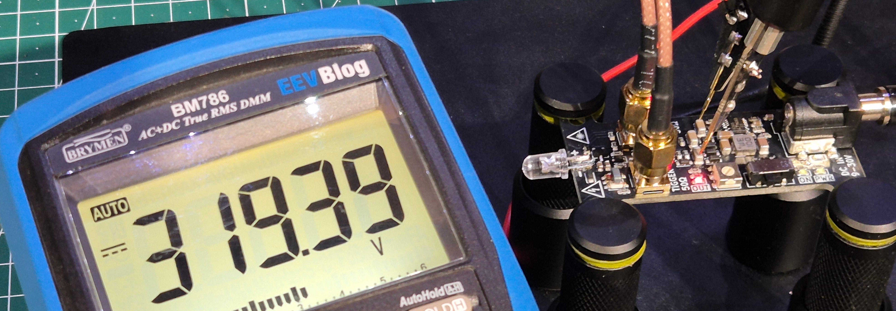 
    </td>
    <td style="text-align:center">
      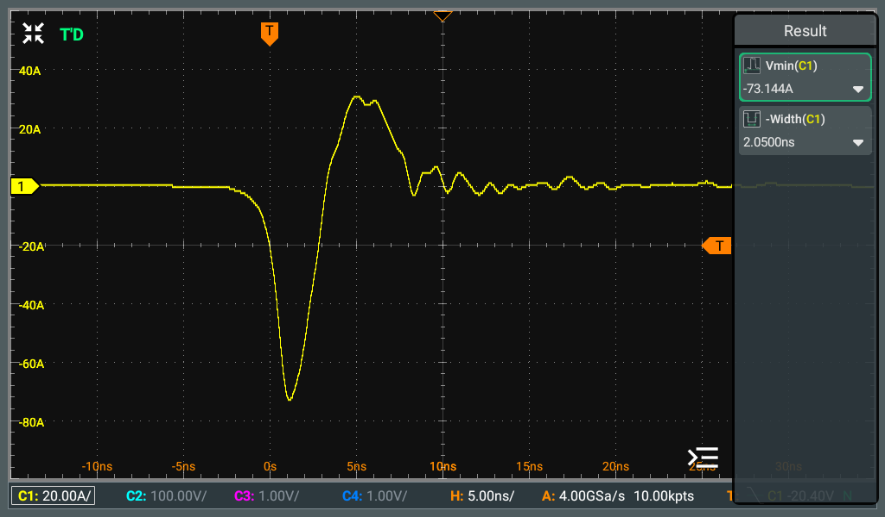 
    </td>
  </tr>
</table>

## ⚠️ Safety Warning

**This project involves high-voltage electronics, high peak currents, and potentially hazardous laser radiation. Anyone building, modifying, or operating this design is responsible for understanding and managing these risks.**

> ⚠️ This repository contains engineering documentation and experimental hardware designs.
> It is not a certified, production-ready, or safety-tested device.

> ⚠️ The circuit contains hazardous high voltages, stored energy, and extremely high peak currents.
> Dangerous voltages may remain present even after the power source has been disconnected.

> ⚠️ Laser diodes driven by this circuit may emit optical pulses capable of causing immediate and permanent eye injury.
> Depending on the laser diode used, hazardous radiation may be invisible.

> ⚠️ Never operate this circuit without appropriate laser safety procedures, protective eyewear suitable for the wavelength used, and adequate electrical safety precautions.

<table style="border: none;">
  <tr>
    <td style="text-align:center">
      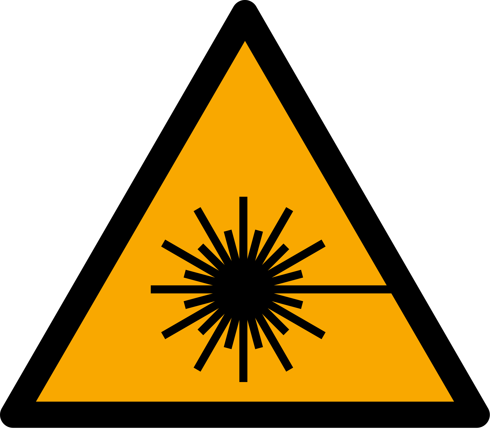 
    </td>
    <td style="text-align:center">
      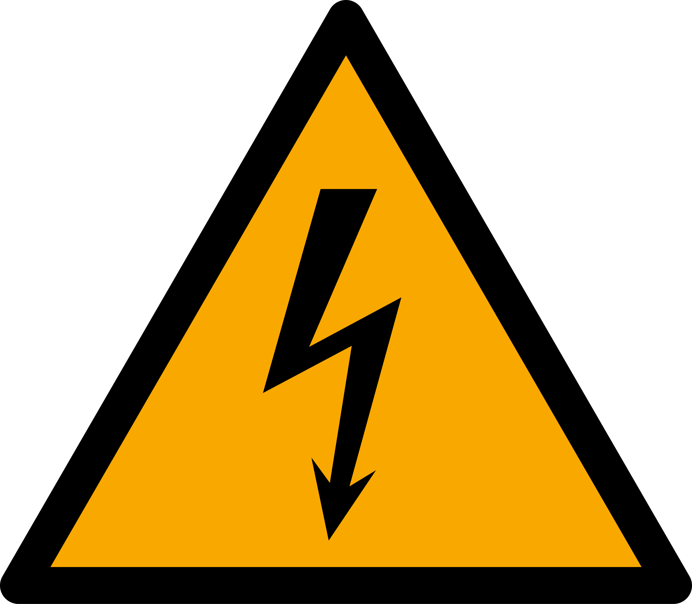 
    </td>
  </tr>
</table>

**Refer to [this explicit safety statement](SAFETY.md) for more information.**

## Table of Contents

- [1. Technical Specification](#1-technical-specification)
  - [1.1 Key Features](#11-key-features)
  - [1.2 Design Specification](#12-design-specification)
  - [1.3 Measured Performance](#13-measured-performance)
- [2. Circuit Design](#2-circuit-design)
  - [2.1 Overview](#21-overview)
  - [2.2 Input Protection](#22-input-protection)
  - [2.3 Boost Converter](#23-boost-converter)
  - [2.4 Avalanche Output Stage](#24-avalanche-output-stage)
  - [2.5 Trigger Input Stage](#25-trigger-input-stage)
- [3. PCB Layout](#3-pcb-layout)
  - [3.1 Physical Dimensions](#31-physical-dimensions)
  - [3.2 Peripheral Components](#32-peripheral-components)
  - [3.3 Assembled Driver Boards](#33-assembled-driver-boards)
- [4. Driver Performance](#4-driver-performance)
  - [4.1 Output Voltage](#41-output-voltage)
  - [4.2 Short Circuit Test](#42-short-circuit-test)
  - [4.3 Blue LED Performance](#43-blue-LED-performance)
  - [4.4 PLPT9 450LC_E Performance](#44-plpt9-450lc_e-performance)
- [5. References](#5-references)
  - [5.1 Datasheets of Main Components](#51-datasheets-of-main-components)
  - [5.2 Reference Designs](#52-reference-designs)
  - [5.3 General Resources](#53-general-resources)
  - [5.4 Design Tools](#54-design-tools)

## 1. Technical Specification

### 1.1 Key Features

This driver circuit is built around the [FMMT417](https://www.diodes.com/datasheet/download/FMMT417.pdf) avalanche transistor and is designed to operate up to the transistor's collector-emitter voltage rating of $320\ V$.
The high voltage is generated by an integrated [LT8365](https://www.analog.com/media/en/technical-documentation/data-sheets/lt8365.pdf) boost converter and can be adjusted from $160\ V$ to $320\ V$ to control the output pulse current.

The driver is externally triggered through a transformer-isolated $50\Omega$ input.
The trigger signal is internally buffered, significantly improving output pulse consistency across a wide range of trigger amplitudes and waveforms.

For monitoring the generated output pulses, the driver includes a current-sense output with a sensitivity of $100\ A/V$, enabling direct observation and measurement of the output pulse waveform.

### 1.2 Design Specification

| Parameter | Value |
|-|-|
| Input Voltage | $9\ V$ to $30\ V$ |
| Output Voltage | $160\ V$ to $320\ V$ |
| Output Capacitance | $200\ pF$ | 
| Current Sense Output| $100\ A/V$ into a $50\ \Omega$ load|
| Input Protection | Reverse voltage protection   Short-circuit protection |
| Trigger Input | $50\ \Omega$ Input   Internally buffered   Transformer-isolated   Immune to DC trigger signals |

> ℹ️ The upper voltage limit is chosen to match the FMMT417's collector-emitter voltage rating of $320\ V$.

> ℹ️ The maximum frequency can be increased by replacing the $47\ k\Omega$ charge current-limiting resistor with a smaller one.

> ℹ️ The actual cutoff voltage of the driver input is $7.5\ V$, but it is not guaranteed that the boost converter can reach its maximum output voltage with inputs below $9\ V$.

### 1.3 Measured Performance

| Parameter | Value |
|-|-|
| Shortest Pulse Width | $2\ ns$ |
| Maximum Pulse Current | $150\ A$ |
| Minimum Avalanche Voltage | $215\ V$|
| Parasitic Output Inductance | $5.5\ nH$ |
| Maximum Frequency | $20\ kHz$ |

## 2. Circuit Design

### 2.1 Overview

  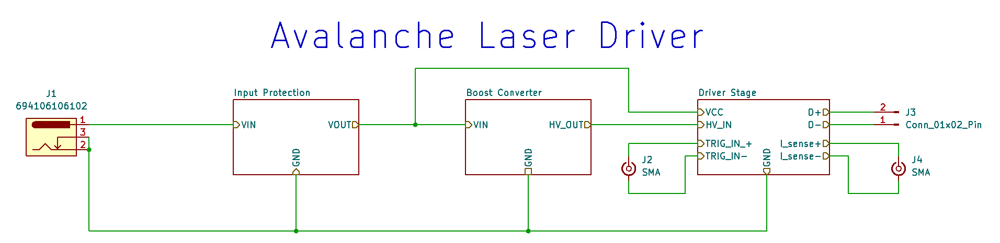 

The complete schematic is available [here](01_Docs/02_Schematic/avalanche_laser_driver_v0_2.pdf) as PDF.

### 2.2 Input Protection

  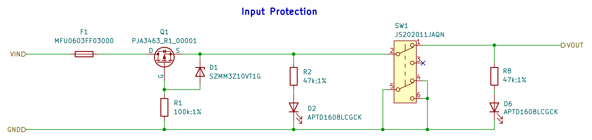 

The driver is protected against reverse input voltages through MOSFET $Q1$.
Additionally, the input stage includes an SMD fuse for short-circuit protection.
A switch is added to physically turn the driver on and off.
Two green LEDs indicate whether the DC input is connected correctly and whether the switch is turned on.

### 2.3 Boost Converter

  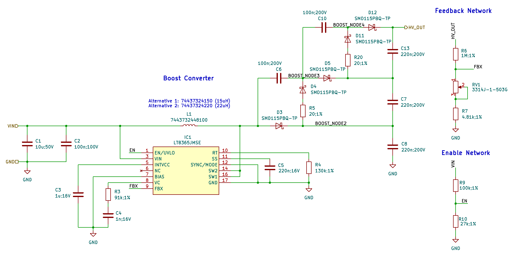 

The high voltage output is generated with an LT8365 boost converter.
Two diode-capacitor stages are added to the output of the boost converter to reach the voltage rating of the FMMT417.
The two additional stages reduce the current available for charging the output capacitors and the output charging resistor $R12$ is sized accordingly.

The output voltage is set by the feedback network formed by $R5$, $R7$ and $RV1$.
The ratio of $R5$ to $R7$ sets the maximum output voltage and $R7$ is tuned to achieve a $320\ V$ output with the assembled circuit.
The theoretical maximum voltage with the selected values $R5=1\ M\Omega$ and $R7=4.81\ k\Omega$ is $334\ V$.

The potentiometer $RV1$ sets the adjustment range of the output voltage.
It should be large enough to cover the whole range from the FMMT417's minimum avalanche voltage (around $215\ V$) to its collector-emitter voltage rating of $320\ V$.
The chosen value of $5\ k\Omega$ is slightly large for that purpose as it gives a lower voltage limit of $160\ V$ which is lower than necessary.
The third terminal of $RV1$ is also connected so that, if the potentiometer wiper fails open-circuit, the potentiometer defaults to its maximum resistance.
In that case the boost converter falls back to its minimum output voltage.

A red LED indicates whether the boost converter output capacitors are charged.

### 2.4 Avalanche Output Stage

  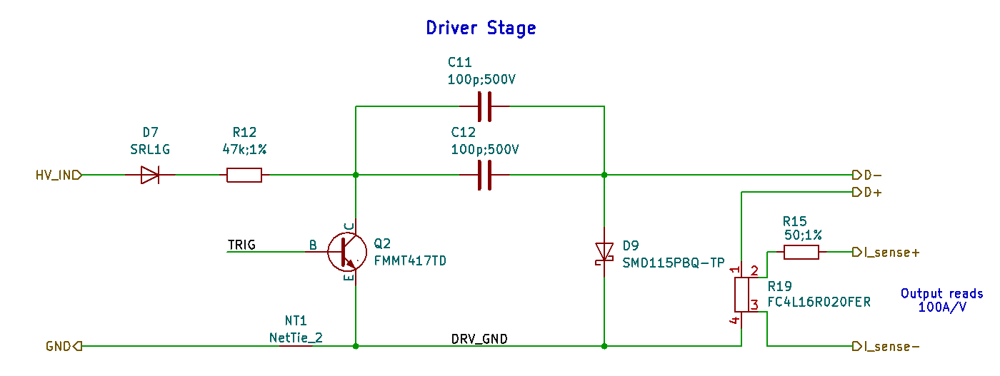 

The core of this driver is a basic avalanche transistor circuit.
The high voltage output capacitors $C11$ and $C12$ are charged through the current-limiting resistor $R12$ and the charging diode $D9$.
Once charged, a small signal at the base of the transistor $Q2$ initiates avalanche breakdown across the collector-emitter junction, resulting in the rapid discharge of $C11$ and $C12$ through the output load.
After an output pulse the capacitors recharge again.

One goal of the output stage is to minimize the parasitic inductance as it is the main limiting factor for the peak pulse current during fast transients.
Therefore, multiple smaller output capacitors in parallel are preferred over a single large one because the effective equivalent series inductance (ESL) is reduced.
In this design two $100\ pF$ 0603 capacitors are used, as the only other smaller capacitors with sufficient current rating ($47\ pF$) were not in stock at the time the driver boards were assembled.

The components $C11$, $C12$ and $R12$ form an RC low-pass which sets the maximum frequency at which the circuit can be triggered.
Assuming that approximately three time constants are required for capacitor recharge, the maximum frequency is approximately $f_{max}\approx \frac{1}{3 \cdot R_{12}(C_{11}+C_{12})} = \frac{1}{3 \cdot 47\ k\Omega(100\ pF+100\ pF)} \approx 35\ kHz$.
The actual frequency is lower than that because the capacitors do not start charging immediately after a pulse, as is shown by the measurements below.

In this design the driver capacitance is $200\ pF$ with a maximum output voltage of $320\ V$.
The maximum stored electrical energy per pulse is $E_p=\frac{1}{2}\cdot C \cdot U^2=\frac{1}{2}\cdot 200\ pF \cdot (320\ V)^2=10.24\ \mu J$.
With the maximum achievable trigger frequency of $20\ kHz$ (see measurements below) the maximum theoretical average output power is approximately $P=E_p\cdot f=10.24\mu J\cdot 20\ kHz=205\ mW$

The $20\ m\Omega$ four-terminal shunt resistor $R19$ is placed in series with the driver output, enabling the pulse current to be monitored.
This low-value resistor has a minimal effect on the pulse current while providing accurate measurements through its two sense terminals.
The circuit's sense output is designed to drive a $50\ \Omega$-terminated oscilloscope input.
Together with the external $50\ \Omega$ termination resistor, the internal $50\ \Omega$ resistor $R15$ forms a $1:2$ voltage divider.
The $20\ m\Omega$ shunt resistor provides a sensitivity of $20\ mV/A$.
This is halved by the voltage divider, resulting in a final sensitivity of $10\ mV/A$ or $100\ A/V$ at the circuit's current sense output.

### 2.5 Trigger Input Stage

  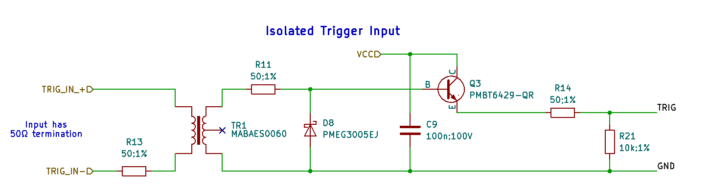 

The trigger input feeds a $50\Omega$ terminated balun transformer $TR1$ for isolation and for high-pass filtering of the input.
The transformed signal is then buffered by the high-speed BJT $Q3$ which is connected to the FMMT417's base through the current-limiting resistor $R14$.
The pull-down resistor $R21$ helps turn off $Q2$ rapidly after an avalanche and prevents accidental triggering caused by a floating base.

The high-pass property of the balun transformer also prevents damage to $Q2$ from DC input signals which would otherwise keep the avalanche transistor turned on.

## 3. PCB Layout

### 3.1 Physical Dimensions

Below is an illustration of the physical outline and hole spacing of the PCB V0.2.
The mounting holes fit the standard $25\ mm$ hole pattern of optical benches.

  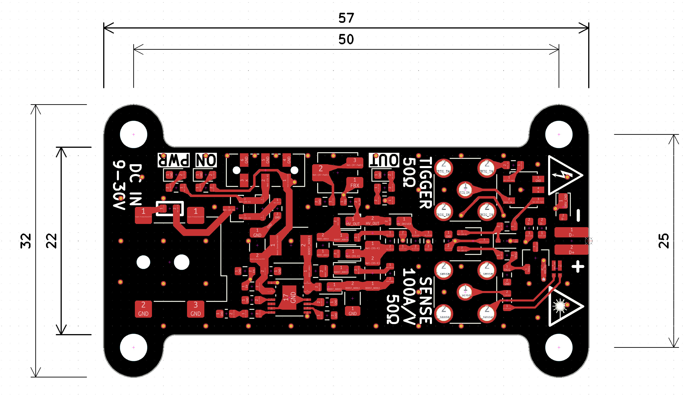 

### 3.2 Peripheral Components

Below is a functional description of the main peripheral components of the PCB.

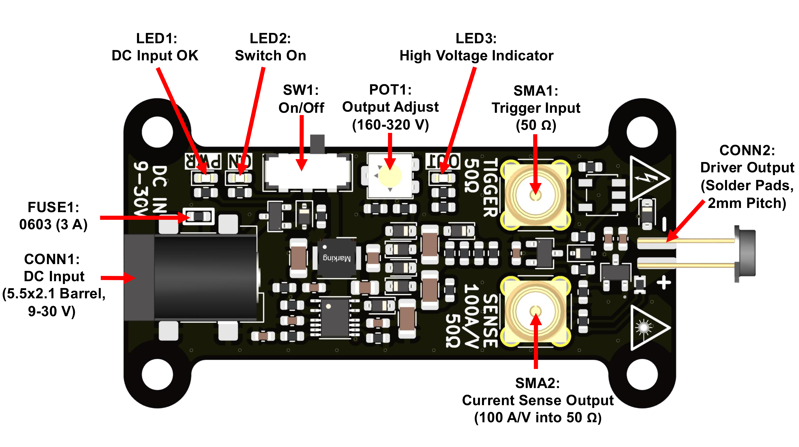 

| Reference | Description |
|-|-|
| SW1   | On/off switch. Switches the supply rail of the boost converter. |
| POT1  | Output voltage adjustment. |
| LED1  | Indicates DC input is connected. |
| LED2  | Indicates the boost converter is supplied. Lights up when SW1 is on. |
| LED3  | Indicates the boost converter output caps are charged. | 
| SMA1  | Trigger input ($50\ \Omega$). | 
| SMA2  | Current sense output ($50\ \Omega$). |
| CONN1 | DC input. 5.5x2.1 Barrel Jack (center positive). |
| CONN2 | Driver output. Solder pads ($2\ mm$ pitch). |
| FUSE1 | 0603 SMD Fuse ($3\ A$) for short-circuit protection. |

### 3.3 Assembled Driver Boards

The two driver boards shown below were assembled for a performance test.
The left driver was assembled with an ams OSRAM PLPT9 450LC_E laser diode and the right one with a blue LED.

<table style="border: none;">
  <tr>
    <td style="text-align:center">
      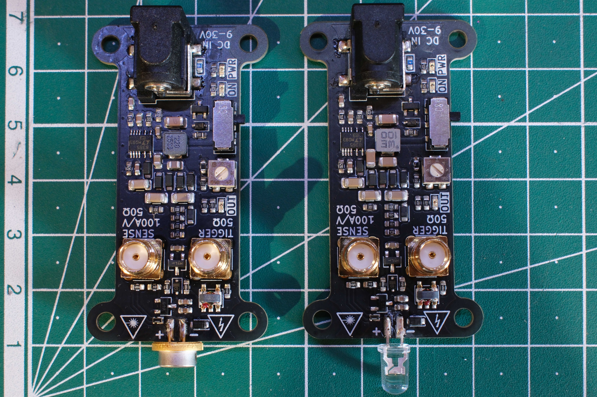 
      
Top view of the V0.2 PCBs

    </td>
    <td style="text-align:center">
      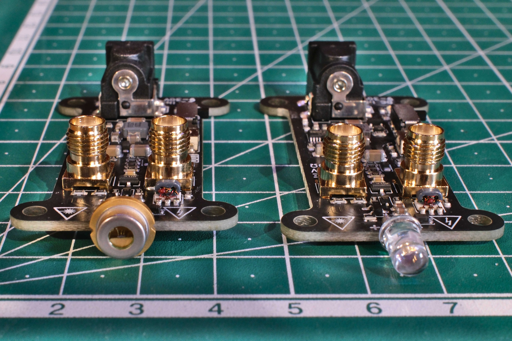 
      
Front view of the V0.2 PCBs

    </td>
  </tr>
</table>

## 4. Driver Performance

Driver performance was evaluated using the following configurations:
- Output pads shorted with solder bridge
- Blue LED (right PCB in above pictures)
- ams OSRAM PLPT9 450LC_E (left PCB in above pictures)

### 4.1 Output voltage

The output voltage of the driver is adjustable between $160\ V$ and $320\ V$.

<table style="border: none;">
  <tr>
    <td style="text-align:center">
      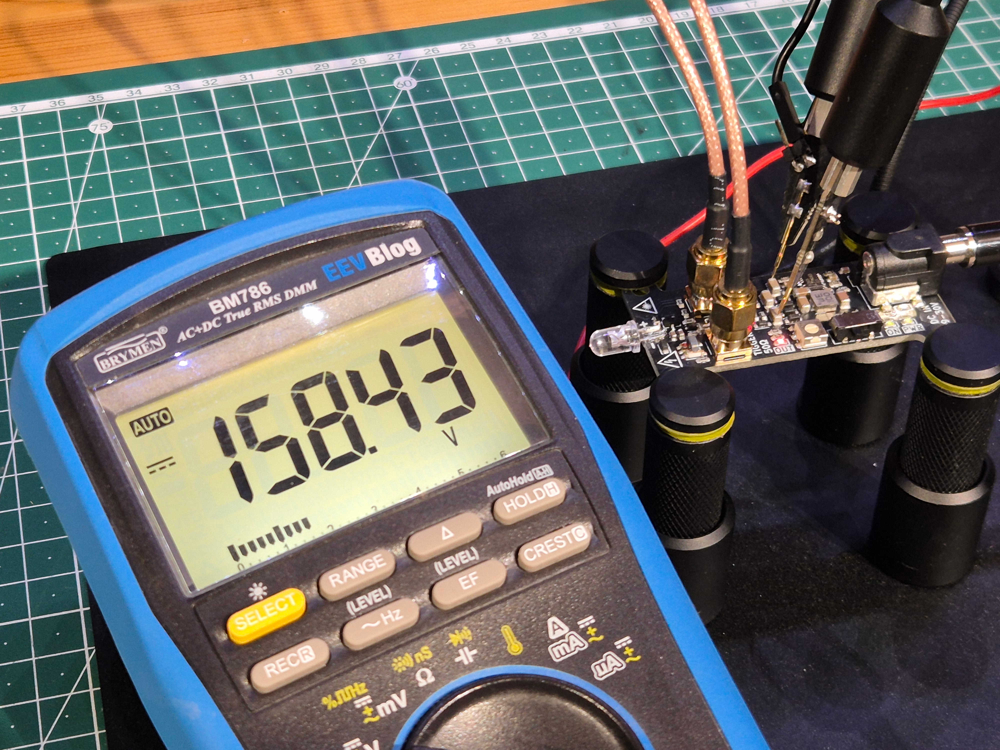 
      
Lower voltage limit of the boost converter

    </td>
    <td style="text-align:center">
      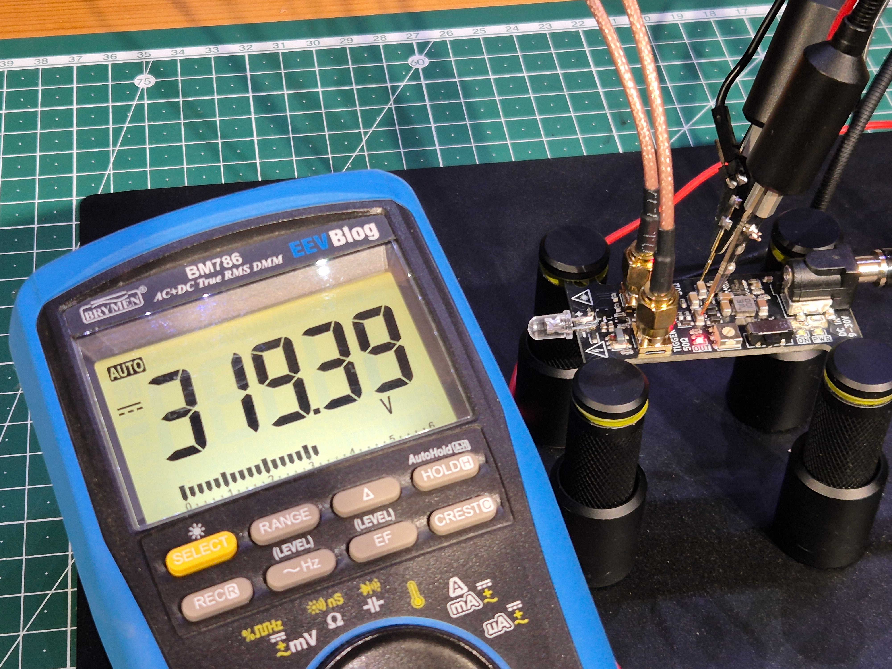 
      
Upper voltage limit of the boost converter

    </td>
  </tr>
</table>

> ℹ️ The feedback resistors should not be replaced to increase the upper voltage limit above $320\ V$.
> Increasing the output voltage risks instant destruction of the FMMT417.

### 4.2 Short-Circuit Test

In the first test the output pads of the driver are shorted with a solder bridge.
The output is set to $320\ V$ and the trigger signal is a $2\ Vpp$ square wave.

  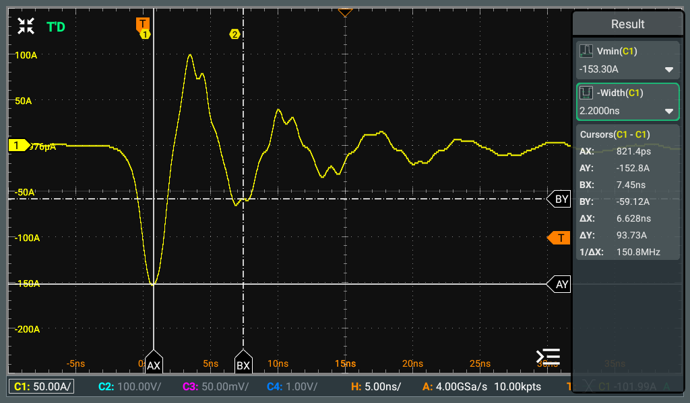 
  
Short-circuit test at 320 V with a 2 Vpp trigger signal

The short-circuit test shows that the output oscillates with no load connected.
This is the expected behavior, because the stored energy is dissipated only slowly through the parasitic impedance of the circuit and there is no diode that blocks reverse current.

In the short-circuit test we measured a maximum current of $153\ A$ with a pulse width of $2.2\ ns$.

The minimum operating voltage at which avalanche triggering occurs was measured to be 215 V with a 5 V square wave trigger signal.
Note that the minimum voltage depends on the trigger signal amplitude.
The lower the output voltage, the larger the trigger signal amplitude must be to start an avalanche.

We can also approximate the effective parasitic loop inductance of the output stage from the observed oscillation.
For this, we assume an LC oscillator with a frequency of $f = \frac{1}{2 \pi \sqrt{LC}}$.
From the measured oscillation frequency we get $f = 152\ MHz$ and the output capacitance is $200\ pF$.
With these values we calculate an inductance of $L = \frac{1}{C(2\pi f)^2} = \frac{1}{200\ pF(2\pi \cdot 152\ MHz)^2} = 5.46\ nH$.

  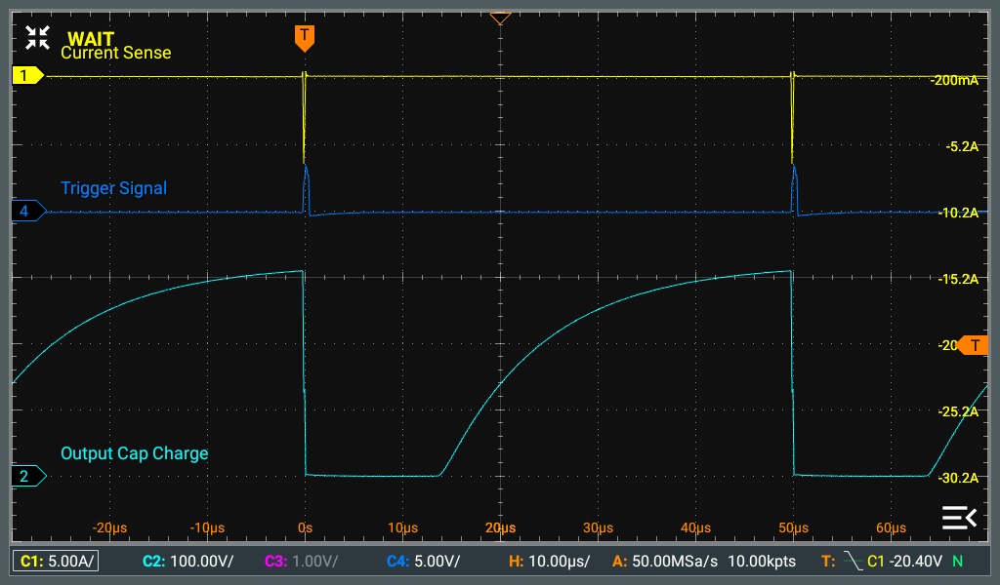 
  
Measurement of the output capacitor charge time

In a second measurement the maximum trigger frequency is tested.
The measurement shows that the output capacitors start charging only after a delay of $14\ us$.
This reduces the actual achievable output frequency from the theoretical $35\ kHz$ to a practically achievable frequency of $20\ kHz$.

### 4.3 Blue LED Performance

In the second test the output drives a blue LED.
The output is set to $320\ V$ and the trigger signal is a $2\ Vpp$ square wave.

  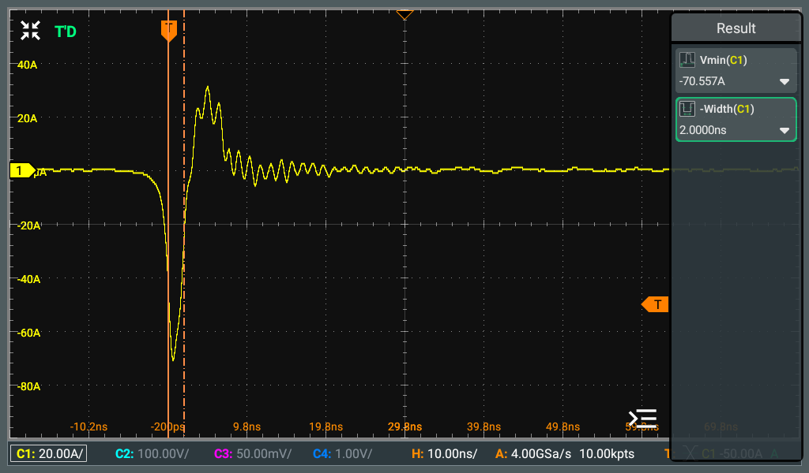 
  
Test with blue LED at 320 V with a 2 Vpp trigger signal

With the blue LED, the output pulse is significantly different compared to the short-circuit test.
There is a large, narrow current pulse across the diode, followed by a smaller, wider pulse in the reverse direction.

With the blue LED, the maximum current is $70\ A$ with a $2\ ns$ pulse width.

### 4.4 PLPT9 450LC_E Performance

In the third test the output drives an ams OSRAM PLPT9 450LC_E.
The output is set to $320\ V$ and the trigger signal is a $2\ Vpp$ square wave.

  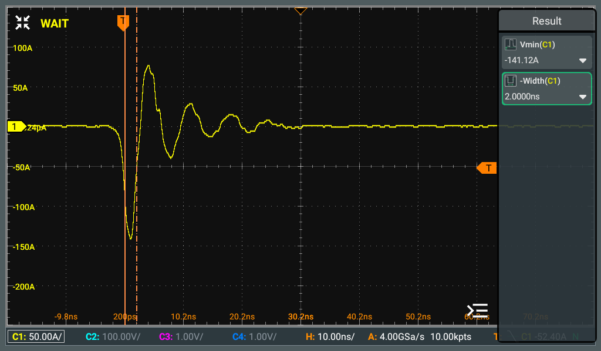 
  
Test with PLPT9 450LC_E at 320 V with a 2 Vpp trigger signal

With the PLPT9 laser diode the maximum current is $141\ A$ with a $2\ ns$ pulse width.

Note that the oscillation is less damped compared to that of the blue LED and more similar to the short-circuit test.
Presumably this is because of the integrated reverse-protection Zener diode in the PLPT9 package which protects the sensitive main laser diode against reverse currents.
It would be interesting to see how this oscillatory behavior actually influences the optical pulse shape of the PLPT9 laser.

Similar to the short-circuit test the oscillation frequency is approximately 150 MHz.

## 5. References
### 5.1 Datasheets of Main Components
- [LT8365](https://www.analog.com/media/en/technical-documentation/data-sheets/lt8365.pdf) Boost converter
- [FMMT417](https://www.diodes.com/datasheet/download/FMMT417.pdf) Avalanche transistor
- [PLPT9 450LC_E](https://look.ams-osram.com/m/8992eec443b4ce2/original/PLPT9-450LC_E.pdf) ams OSRAM Laser Diode

### 5.2 Reference Designs
- [Les' Lab Laser Driver](https://github.com/leswright1977/avalanche-laser-diode-driver) + [Video](https://www.youtube.com/watch?v=3-htF8Jrixo&t=24s) (ZTX415/ 2N5192G)
- [BigPulse Driver](https://github.com/MazinLab/BigPulse) + [Video](https://www.youtube.com/watch?v=OXhiX0EW5MI) (FMMT415TD + LT8365)

### 5.3 General Resources
- Lasercomponents [Whitepaper](https://www.lasercomponents.com/uk/photonics-portal/knowledge-center/whitepapers/drive-electronics-for-pulsed-laser-diodes/)
- Zetex ZTX415 [Application Note AN8](https://user-web.icecube.wisc.edu/~kitamura/NK/Flasher_Board/Useful/research/AN8.pdf)
- Jim Williams Pulser [AN47 Appendix D (p. 93)](https://www.analog.com/media/en/technical-documentation/application-notes/an47fa.pdf)
- Selection and usage of laser safety goggles [DGUV 203-042](https://publikationen.dguv.de/widgets/pdf/download/article/249) (German)

### 5.4 Design Tools
- [LTSpice](https://www.analog.com/en/resources/design-tools-and-calculators/ltspice-simulator.html) Circuit simulation
- [KiCAD 10](https://www.kicad.org/blog/2026/03/Version-10.0.0-Released/) Circuit board design
- [SMath Studio](https://smath.com/) Design calculations

## License

This project is licensed under the CERN Open Hardware Licence Version 2 - Permissive ([CERN-OHL-P](https://ohwr.org/cern_ohl_p_v2.txt)).

Third-party datasheets, logos, warning symbols, and referenced documentation remain the property of their respective owners.